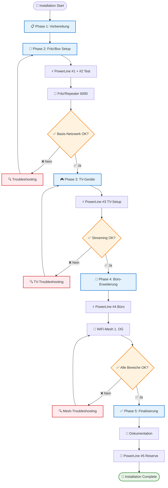

# Home Network Installation Guide

## Überblick
Diese Anleitung führt Sie Schritt für Schritt durch die Installation Ihres Home-Netzwerks mit AVM Fritz!-Komponenten.

## Installationsablauf (Diagramm)



## Benötigte Komponenten
- 1x Fritz!Box 5590 Fiber
- 1x Fritz!Repeater 6000
- 5x Fritz!Powerline 1220
- LAN-Kabel (verschiedene Längen)
- Computer/Laptop für Konfiguration

## Zeitplanung
- **Gesamtdauer**: 4-5 Stunden
- **Empfehlung**: Kompletter Tag am Wochenende
- **Pausen**: Nach jeder Phase einplanen

---

## 📋 Phase 1: Vorbereitung (30 min)

### Checkliste vor dem Start:
- [ ] Alle Komponenten ausgepackt und geprüft
- [ ] Steckdosen in allen Räumen getestet
- [ ] LAN-Kabel in verschiedenen Längen bereit
- [ ] Smartphone/Laptop für Konfiguration bereit
- [ ] Glasfaser-Zugangsdaten vom Provider verfügbar
- [ ] Neuen WLAN-Namen und Passwort festgelegt
- [ ] Aktuelles Internet-Backup (falls vorhanden)

### Benötigte Zugangsdaten:
```
📝 Zugangsdaten sammeln:
- Glasfaser-Anschluss: [Provider-Daten]
- WLAN-Name (SSID): [Neuer Name]
- WLAN-Passwort: [Starkes Passwort]
- Admin-Passwort: [Für Fritz!Box]
```

### Installationsreihenfolge:
1. **Kellergeschoss**: Fritz!Box + PowerLine #1
2. **Erdgeschoss**: PowerLine #2 + Fritz!Repeater 6000
3. **Erdgeschoss**: PowerLine #3 + TV-Geräte
4. **2. Zwischengeschoss**: PowerLine #4 + Büro
5. **1. Obergeschoss**: WiFi-Mesh Repeater
6. **Reserve**: PowerLine #5 für später

---

## 🔧 Phase 2: Kern-Installation (90 min)

### Schritt 1: Fritz!Box 5590 Fiber einrichten (45 min)

#### Physische Installation:
```
Kellergeschoss:
1. Fritz!Box neben Glasfaser-Anschluss platzieren
2. Glasfaser-Kabel anschließen
3. Stromkabel verbinden
4. Computer per LAN-Kabel an Fritz!Box (Port 1)
5. Fritz!Box einschalten und 2 min warten
```

#### Software-Konfiguration:
```
1. Browser öffnen: http://fritz.box
2. Einrichtungsassistent starten
3. Glasfaser-Zugangsdaten eingeben
4. Internet-Verbindung testen
5. ⚠️ WICHTIG: WiFi DEAKTIVIEREN
6. DHCP-Bereich: 192.168.178.20-250
7. Admin-Passwort setzen
8. Konfiguration speichern
```

#### Testen:
- [ ] Internet-Zugang funktioniert
- [ ] WiFi ist deaktiviert
- [ ] Fritz!Box unter 192.168.178.1 erreichbar

### Schritt 2: PowerLine-Verbindung aufbauen (30 min)

#### PowerLine #1 (Keller):
```
1. PowerLine #1 in Wandsteckdose (Keller)
2. LAN-Kabel: Fritz!Box Port 2 → PowerLine #1
3. Power-LED prüfen (muss leuchten)
```

#### PowerLine #2 (Erdgeschoss):
```
1. PowerLine #2 in Wandsteckdose (Erdgeschoss)
2. Powerline-Taste an beiden Adaptern drücken (Verschlüsselung)
3. 2 Minuten warten
4. PowerLine-LED prüfen (beide grün)
```

#### Testen:
- [ ] Beide PowerLine-LEDs leuchten grün
- [ ] Verbindung stabil (LED nicht blinkend)

### Schritt 3: Fritz!Repeater 6000 einrichten (45 min)

#### Physische Installation:
```
Erdgeschoss:
1. Repeater in optimaler Position aufstellen
2. LAN-Kabel: PowerLine #2 → Repeater
3. Repeater einschalten
4. 2 Minuten warten
```

#### Software-Konfiguration:
```
1. Computer per LAN an Repeater anschließen
2. Browser: http://fritz.repeater
3. Betriebsart: "Access Point" wählen
4. WLAN-Einstellungen:
   - SSID: [Gleicher Name wie geplant]
   - Passwort: [Gleiches Passwort wie geplant]
   - Verschlüsselung: WPA3
5. Mesh-Funktion: AKTIVIEREN
6. Konfiguration speichern
```

#### Testen:
- [ ] Repeater per LAN erreichbar
- [ ] WLAN wird ausgestrahlt
- [ ] Internet über WLAN funktioniert
- [ ] Mesh-Status "aktiv"

---

## 🎮 Phase 3: Entertainment-Geräte (45 min)

### Schritt 4: TV-PowerLine einrichten (30 min)

#### PowerLine #3 (TV-Geräte):
```
1. PowerLine #3 in Wandsteckdose (Erdgeschoss, TV-Bereich)
2. PowerLine-Taste drücken für Netzwerk-Beitritt
3. 2 Minuten warten
4. PowerLine-LED prüfen (grün)
```

#### TV-Geräte anschließen:
```
1. Samsung SmartTV:
   - LAN-Kabel: PowerLine #3 Port 1 → TV
   - Netzwerk-Einstellungen: Automatisch (DHCP)
   - Internet-Verbindung testen

2. Apple TV 4K:
   - LAN-Kabel: PowerLine #3 Port 2 → Apple TV
   - Netzwerk-Einstellungen: Automatisch (DHCP)
   - Internet-Verbindung testen
```

#### Testen:
- [ ] Samsung SmartTV hat Internet
- [ ] Apple TV 4K hat Internet
- [ ] Streaming-Test (Netflix, YouTube)
- [ ] Keine Ruckler oder Unterbrechungen

### Schritt 5: Streaming-Optimierung (15 min)

#### Qualitätsprüfung:
```
1. 4K-Video auf Samsung TV streamen
2. 4K-Video auf Apple TV streamen
3. Gleichzeitig auf beiden Geräten testen
4. Geschwindigkeit messen: >50 Mbit/s pro Gerät
```

---

## 🏢 Phase 4: Büro-Erweiterung (75 min)

### Schritt 6: Büro-PowerLine (30 min)

#### PowerLine #4 (2. Zwischengeschoss):
```
1. PowerLine #4 in Wandsteckdose (Büro/Gästezimmer)
2. PowerLine-Taste drücken für Netzwerk-Beitritt
3. 2 Minuten warten
4. PowerLine-LED prüfen (grün)
5. Computer per LAN anschließen
6. Netzwerk-Verbindung testen
```

#### Testen:
- [ ] Computer hat Internet über LAN
- [ ] Geschwindigkeit: >100 Mbit/s
- [ ] Stabile Verbindung

### Schritt 7: WiFi-Mesh (1. Obergeschoss) (45 min)

#### Vorhandenen Fritz!Repeater einrichten:
```
1. Fritz!Repeater im Büro (1. OG) einschalten
2. Computer per LAN an Repeater
3. Browser: http://fritz.repeater
4. Betriebsart: "Mesh-Repeater"
5. Mit Fritz!Repeater 6000 verbinden
6. WLAN-Einstellungen übernehmen
7. Mesh-Verbindung aktivieren
```

#### Mesh-Optimierung:
```
1. Position des Repeaters optimieren
2. Signalstärke prüfen
3. Roaming zwischen Repeatern testen
4. 5GHz-Band bevorzugen
5. Automatische Kanalwahl aktivieren
```

#### Testen:
- [ ] Mesh-Verbindung aktiv
- [ ] Nahtloses Roaming zwischen Stockwerken
- [ ] WiFi-Geschwindigkeit: >50 Mbit/s
- [ ] Alle Bereiche abgedeckt

---

## ✅ Phase 5: Finalisierung (60 min)

### Schritt 8: Gesamtsystem-Test (30 min)

#### Netzwerk-Geschwindigkeit messen:
```
Geschwindigkeitstests in allen Bereichen:
- Keller (LAN Fritz!Box): >500 Mbit/s
- Erdgeschoss (WiFi): >100 Mbit/s
- Erdgeschoss (TV LAN): >100 Mbit/s
- 1. Obergeschoss (WiFi): >50 Mbit/s
- 2. Zwischengeschoss (LAN): >100 Mbit/s
```

#### Funktionalitäts-Test:
```
1. Roaming-Test: Handy zwischen Stockwerken
2. Simultaner Streaming-Test auf allen Geräten
3. Video-Konferenz im Büro
4. Online-Gaming testen
5. Alle Geräte gleichzeitig belasten
```

### Schritt 9: Dokumentation (30 min)

#### Netzwerk-Konfiguration dokumentieren:
```
📝 Geräte-Liste:
- Fritz!Box 5590: 192.168.178.1
- Fritz!Repeater 6000: 192.168.178.2
- Fritz!Repeater (1. OG): 192.168.178.3
- Samsung SmartTV: 192.168.178.10
- Apple TV 4K: 192.168.178.11
- PowerLine #4: 192.168.178.4

📝 WLAN-Daten:
- SSID: [Ihr WLAN-Name]
- Passwort: [Ihr Passwort]
- Verschlüsselung: WPA3

📝 PowerLine-Netzwerk:
- 5 Adapter im gleichen Netzwerk
- AES-Verschlüsselung aktiv
- Geschwindigkeit: bis 1200 Mbit/s
```

#### Backup erstellen:
```
1. Fritz!Box-Konfiguration exportieren
2. Repeater-Einstellungen sichern
3. Passwörter sicher speichern
4. Netzwerk-Diagramm ausdrucken
```

### Reserve-Adapter vorbereiten:
```
PowerLine #5 (Reserve):
1. Adapter mit Netzwerk-Schlüssel versehen
2. Testen und wieder einpacken
3. Für zukünftige Erweiterungen bereit
```

---

## 🚨 Troubleshooting

### PowerLine-Probleme:
```
❌ Problem: PowerLine-LED rot/nicht verbunden
✅ Lösung:
1. Adapter in andere Steckdose stecken
2. Powerline-Taste erneut drücken
3. 2 Minuten warten
4. Bei Bedarf alle Adapter zurücksetzen
```

### WiFi-Probleme:
```
❌ Problem: Schwaches WiFi-Signal
✅ Lösung:
1. Repeater-Position ändern
2. 5GHz-Band bevorzugen
3. Kanal manuell wählen
4. Mesh-Verbindung neu aufbauen
```

### Internet-Probleme:
```
❌ Problem: Kein Internet
✅ Lösung:
1. Glasfaser-Verbindung prüfen
2. Fritz!Box neustarten
3. Provider-Einstellungen überprüfen
4. DNS-Server ändern (8.8.8.8)
```

### Streaming-Probleme:
```
❌ Problem: Ruckelnde Videos
✅ Lösung:
1. LAN-Kabel prüfen
2. PowerLine-Position ändern
3. Gleichzeitige Downloads stoppen
4. QoS-Einstellungen aktivieren
```

---

## 📊 Erfolgskontrolle

### Checkliste finale Abnahme:
- [ ] Internet in allen Bereichen verfügbar
- [ ] WiFi-Roaming funktioniert nahtlos
- [ ] TV-Streaming in 4K ohne Probleme
- [ ] Büro-Arbeitsplatz voll funktionsfähig
- [ ] Alle Geräte korrekt konfiguriert
- [ ] Konfiguration dokumentiert und gesichert
- [ ] Reserve-Adapter vorbereitet

### Leistungsziele erreicht:
- [ ] Glasfaser-Geschwindigkeit voll ausgenutzt
- [ ] Alle 7 Stockwerke abgedeckt
- [ ] Entertainment-Bereich optimiert
- [ ] Büro-Arbeitsplätze professionell
- [ ] Zukunftssicher für Erweiterungen

---

## 🎉 Herzlichen Glückwunsch!

Ihr professionelles Home-Netzwerk ist jetzt einsatzbereit!

### Nächste Schritte:
1. **Monitoring**: Regelmäßige Geschwindigkeitstests
2. **Updates**: Firmware-Updates alle 3 Monate
3. **Erweiterung**: PowerLine #5 für weitere Bereiche
4. **Optimierung**: Laufende Anpassungen je nach Bedarf

### Support-Kontakte:
- **AVM Support**: support.avm.de
- **Provider-Hotline**: [Ihr Glasfaser-Provider]
- **Diese Dokumentation**: Für zukünftige Referenz

**Viel Spaß mit Ihrem neuen Netzwerk! 🚀**