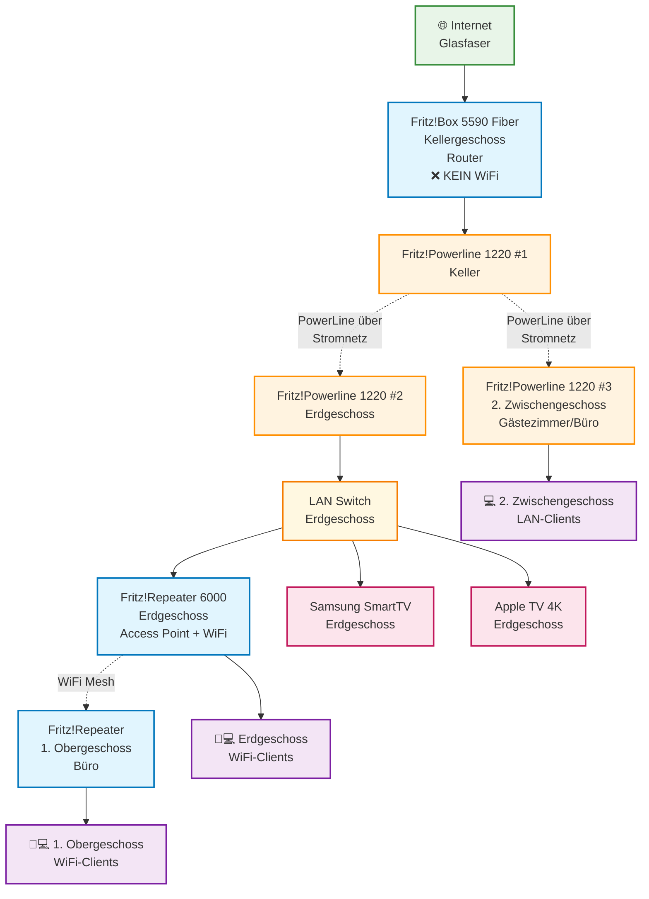

# Home Network Spezifikation

## Überblick
Diese Spezifikation beschreibt den erweiterten Aufbau des Home-Netzwerks mit AVM Fritz!-Komponenten für ein 7-stöckiges Gebäude.

## Verfügbare Komponenten
- 1x Fritz!Box 5590 Fiber (Hauptrouter)
- 1x Fritz! Repeater 6000 (Access Point)
- 3x Fritz! Powerline 1220 (PowerLine-Adapter)

## Gebäude-Struktur
1. **Kellergeschoss** - Glasfaseranschluss
2. **Zwischengeschoss Garage**
3. **Erdgeschoss** - SmartTV + Apple TV 4K
4. **1. Zwischengeschoss Bad**
5. **1. Obergeschoss** - Schlafen, Kinderzimmer, Büro, Dusche
6. **2. Zwischengeschoss** - Gästezimmer, Büro
7. **2. Obergeschoss** - Schlafen, Wohnen, Dachboden

## Netzwerk-Diagramm



## ASCII-Diagramm (für lokale Ansicht)

```
┌──────────────────────────────────────────────────────────────────────────────┐
│                      2. OBERGESCHOSS                                        │
│                   Schlafen, Wohnen, Dachboden                               │
└──────────────────────────────────────────────────────────────────────────────┘

┌──────────────────────────────────────────────────────────────────────────────┐
│                    2. ZWISCHENGESCHOSS                                       │
│                   Gästezimmer, Büro                                          │
│                                                                              │
│  ┌─────────────────────────────────────────────────────────────────────────┐ │
│  │                Fritz!Powerline 1220 #3                                 │ │
│  │              💻 LAN für Büro/Gästezimmer                               │ │
│  └─────────────────────────────────────────────────────────────────────────┘ │
│                                    │                                        │
│                                    │ PowerLine                              │
└────────────────────────────────────┼────────────────────────────────────────┘
                                     │
┌────────────────────────────────────┼────────────────────────────────────────┐
│                  1. OBERGESCHOSS   │                                        │
│           Schlafen, Kinderzimmer, Büro, Dusche                              │
│                                    │                                        │
│  ┌─────────────────────────────────────────────────────────────────────────┐ │
│  │        Fritz!Repeater (vorhandener)                                    │ │
│  │               📱💻 WiFi Mesh                                            │ │
│  └─────────────────────────────────────────────────────────────────────────┘ │
│                                    │ WiFi Mesh                              │
└────────────────────────────────────┼────────────────────────────────────────┘
                                     │
┌────────────────────────────────────┼────────────────────────────────────────┐
│                1. ZWISCHENGESCHOSS │                                        │
│                        Bad         │                                        │
└────────────────────────────────────┼────────────────────────────────────────┘
                                     │
┌────────────────────────────────────┼────────────────────────────────────────┐
│                   ERDGESCHOSS      │                                        │
│                                    │                                        │
│  ┌─────────────────────┐  ┌─────────┴─────────────────────────────────────┐ │
│  │ Fritz!Powerline     │  │        LAN Switch                             │ │
│  │    1220 #2          │──┤                                               │ │
│  └─────────────────────┘  │  ┌─────────────────────────────────────────┐  │ │
│                           │  │     Fritz!Repeater 6000                │  │ │
│                           │  │     (Access Point + WiFi)               │  │ │
│                           │  └─────────────────────────────────────────┘  │ │
│                           │                                               │ │
│                           │  ┌─────────────────────────────────────────┐  │ │
│                           │  │        Samsung SmartTV                   │  │ │
│                           │  └─────────────────────────────────────────┘  │ │
│                           │                                               │ │
│                           │  ┌─────────────────────────────────────────┐  │ │
│                           │  │        Apple TV 4K                       │  │ │
│                           │  └─────────────────────────────────────────┘  │ │
│                           └───────────────────────────────────────────────┘ │
│                                                  │                          │
│                                                  │ WiFi                     │
│                                                  ▼                          │
│                                          📱💻📱 Erdgeschoss-Geräte          │
└────────────────────────────────────────┼─────────────────────────────────────┘
                                         │
                                         │ PowerLine über Stromnetz
                                         │
┌────────────────────────────────────────┼─────────────────────────────────────┐
│            ZWISCHENGESCHOSS GARAGE     │                                     │
└────────────────────────────────────────┼─────────────────────────────────────┘
                                         │
┌────────────────────────────────────────┼─────────────────────────────────────┐
│                 KELLERGESCHOSS         │                                     │
│                                        │                                     │
│            ┌─────────────────────┐     ▼                                     │
│            │ Fritz!Powerline     │  ┌─────────────────────────────────────┐  │
│            │    1220 #1          │──│     Fritz!Box 5590 Fiber           │  │
│            └─────────────────────┘  │     (Hauptrouter)                   │  │
│                                     │     ❌ KEIN WiFi                    │  │
│                                     └─────────────────────────────────────┘  │
│                                                      │                      │
│                                                      │ Glasfaser            │
│                                                      ▼                      │
│                                              🌐 Internet                    │
└──────────────────────────────────────────────────────────────────────────────┘
```

## Detaillierte Konfiguration

### Kellergeschoss
#### Fritz!Box 5590 Fiber
- **Betriebsart**: Router-Modus
- **Internet**: Glasfaser-Anschluss
- **DHCP**: Aktiviert (IP-Bereich: 192.168.178.1-254)
- **WiFi**: ❌ **DEAKTIVIERT** (wichtige Anforderung!)
- **LAN**: Port 1 für Fritz!Powerline 1220 #1
- **Funktion**: Hauptrouter, Internet-Gateway, DHCP-Server

### Erdgeschoss
#### Fritz!Powerline 1220 #2
- **Verbindung**: PowerLine zum Keller
- **LAN-Ausgang**: An LAN-Switch angeschlossen

#### LAN-Switch (zusätzlich benötigt)
- **Anschlüsse**: 4-5 Ports minimum
- **Verbindungen**:
  - Fritz!Repeater 6000
  - Samsung SmartTV
  - Apple TV 4K
  - Evtl. weitere Geräte

#### Fritz!Repeater 6000
- **Betriebsart**: Access Point-Modus
- **Verbindung**: LAN über Switch (PowerLine-Kette)
- **WiFi**: Aktiviert für Erdgeschoss
- **SSID**: "HomeNetwork" (Beispiel)
- **Mesh**: Aktiviert für Verbindung zu anderen Fritz!-Geräten

#### Entertainment-Geräte
- **Samsung SmartTV**: LAN-Verbindung über Switch
- **Apple TV 4K**: LAN-Verbindung über Switch

### 1. Obergeschoss (Büro)
#### Fritz!Repeater (vorhandener)
- **Betriebsart**: Mesh-Repeater
- **Verbindung**: WiFi Mesh zum Fritz!Repeater 6000
- **WiFi**: Aktiviert für 1. Obergeschoss
- **SSID**: "HomeNetwork" (gleiche wie Erdgeschoss)
- **Abdeckung**: Schlafen, Kinderzimmer, Büro, Dusche

### 2. Zwischengeschoss (Gästezimmer/Büro)
#### Fritz!Powerline 1220 #3
- **Verbindung**: PowerLine-Netzwerk
- **LAN-Ausgang**: Für Computer/Laptops im Büro
- **Funktion**: Kabelgebundenes Internet für Arbeitsplätze

## Netzwerk-Topologie

### IP-Adress-Schema
- **Fritz!Box**: 192.168.178.1 (Gateway)
- **Fritz!Repeater 6000**: 192.168.178.2
- **Fritz!Repeater (1. OG)**: 192.168.178.3
- **Samsung SmartTV**: 192.168.178.10
- **Apple TV 4K**: 192.168.178.11
- **DHCP-Pool**: 192.168.178.20-250

### WLAN-Konfiguration
- **SSID**: "HomeNetwork"
- **Passwort**: [Starkes Passwort]
- **Verschlüsselung**: WPA3 (oder WPA2 falls nicht unterstützt)
- **5GHz**: Aktiviert mit höherer Priorität
- **2.4GHz**: Aktiviert für Kompatibilität

### PowerLine-Konfiguration
- **Verschlüsselung**: AES 128-Bit aktiviert
- **Alle 3 Adapter**: Im gleichen PowerLine-Netzwerk
- **Geschwindigkeit**: Bis zu 1.200 Mbit/s theoretisch

## Zusätzlich benötigte Komponenten

⚠️ **Wichtig**: Für diese Konfiguration benötigen Sie zusätzlich:
- **1x LAN-Switch** (mindestens 4 Ports) für das Erdgeschoss
- **LAN-Kabel** für alle Verbindungen

## Abdeckung pro Stockwerk

| Stockwerk | Netzwerk-Typ | Gerät | Abdeckung |
|-----------|--------------|-------|-----------|
| Kellergeschoss | LAN only | Fritz!Box 5590 | Nur LAN-Ports |
| Erdgeschoss | WiFi + LAN | Fritz!Repeater 6000 + Switch | Vollständige Abdeckung |
| 1. Obergeschoss | WiFi Mesh | Fritz!Repeater (vorh.) | Vollständige Abdeckung |
| 2. Zwischengeschoss | LAN | Fritz!Powerline 1220 #3 | Büro/Gästezimmer |
| Andere Stockwerke | WiFi | Via Mesh-Ausstrahlung | Begrenzte Abdeckung |

## Wichtige Anforderungen (Status)

✅ **Fritz!Box und Fritz!Repeater per PowerLine verbunden**
✅ **Fritz!Box WiFi deaktiviert**
✅ **Fritz!Repeater 6000 als Access Point konfiguriert**
✅ **SmartTV und Apple TV per LAN eingebunden**
✅ **Büro-Fritz!Repeater per WiFi Mesh verbunden**
✅ **PowerLine im 2. Zwischengeschoss für Büro**

## Vorteile dieser Lösung

- **Stabile Backbone-Verbindung**: PowerLine zwischen Keller und Erdgeschoss
- **Optimale Entertainment-Qualität**: LAN für TV-Geräte
- **Mesh-Abdeckung**: Nahtloses WiFi in bewohnten Bereichen
- **Büro-Anbindung**: Sowohl WiFi (1. OG) als auch LAN (2. ZG)
- **Energieeffizient**: Kein unnötiges WiFi im Keller

## Erweiterungsmöglichkeiten

- **Weitere Stockwerke**: Zusätzliche Mesh-Repeater
- **Mehr LAN-Ports**: Weitere Switches an PowerLine-Adaptern
- **Professionelle Arbeitsplätze**: Zusätzliche LAN-Verkabelung
- **Garten/Terrasse**: Outdoor-WiFi-Erweiterung

## Troubleshooting

### PowerLine-Probleme
- **Keine Verbindung**: Adapter auf verschiedene Stromkreise verteilen
- **Langsame Geschwindigkeit**: Direkte Steckdose verwenden (keine Mehrfachsteckdosen)
- **Verbindungsabbrüche**: Firmware-Updates prüfen

### WiFi-Probleme
- **Schwaches Signal**: Repeater-Position optimieren
- **Mesh-Verbindung**: Automatische Kanalwahl aktivieren
- **Interferenzen**: 5GHz bevorzugen, 2.4GHz-Kanal manuell wählen

### Entertainment-Probleme
- **Streaming-Qualität**: LAN-Verbindung prüfen
- **Netzwerk-Erkennung**: DHCP-Reservierung für TV-Geräte
- **Apple TV**: Airplay-Einstellungen überprüfen