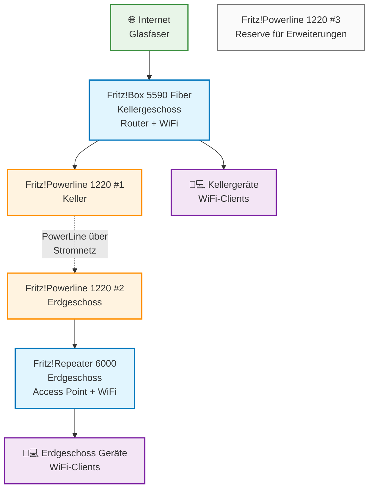

# Home Network Dokumentation

## Überblick
Diese Dokumentation beschreibt den Aufbau und die Konfiguration des Home-Netzwerks mit AVM Fritz!-Komponenten.

## Verfügbare Komponenten
- 1x Fritz!Box 5590 Fiber (Hauptrouter)
- 1x Fritz! Repeater 6000 (Access Point)
- 3x Fritz! Powerline 1220 (PowerLine-Adapter)

## Netzwerk-Diagramm



## ASCII-Diagramm (für lokale Ansicht)

```
┌─────────────────────────────────────────────────────────────────┐
│                         ERDGESCHOSS                             │
│                                                                 │
│  ┌─────────────────────┐     ┌─────────────────────────────────┐ │
│  │   Fritz!Powerline   │────▶│     Fritz!Repeater 6000        │ │
│  │      1220 #2        │ LAN │      (Access Point)            │ │
│  │                     │     │                                 │ │
│  └─────────────────────┘     └─────────────────────────────────┘ │
│            │                                   │                 │
│            │                                   │                 │
│            │ PowerLine                         │ WiFi            │
│            │ über                              │                 │
│            │ Stromnetz                         ▼                 │
│            │                         📱💻📱 (Smartphones,       │
│            │                              Laptops, etc.)        │
└────────────┼─────────────────────────────────────────────────────┘
             │
             │ PowerLine-Verbindung
             │ über Stromleitungen
             │
┌────────────┼─────────────────────────────────────────────────────┐
│            │                 KELLERGESCHOSS                      │
│            │                                                     │
│            ▼                                                     │
│  ┌─────────────────────┐     ┌─────────────────────────────────┐ │
│  │   Fritz!Powerline   │────▶│     Fritz!Box 5590 Fiber       │ │
│  │      1220 #1        │ LAN │        (Hauptrouter)           │ │
│  │                     │     │                                 │ │
│  └─────────────────────┘     └─────────────────────────────────┘ │
│                                            │                     │
│                                            │                     │
│                                            │ Glasfaser           │
│                                            ▼                     │
│                                    🌐 Internet                   │
│                                                                  │
│                                WiFi für Kellergeschoss ──────────┤
│                                            │                     │
│                                            ▼                     │
│                                    📱💻📱 (Kellergeräte)        │
└──────────────────────────────────────────────────────────────────┘

┌─────────────────────────────────────────────────────────────────┐
│                           RESERVE                               │
│                                                                 │
│              ┌─────────────────────────────────────┐            │
│              │        Fritz!Powerline 1220 #3     │            │
│              │         (für Erweiterungen)        │            │
│              └─────────────────────────────────────┘            │
└─────────────────────────────────────────────────────────────────┘
```

## Physische Aufstellung

### Kellergeschoss
- **Fritz!Box 5590 Fiber**
  - Standort: Kellergeschoss (Glasfaseranschluss)
  - Funktion: Hauptrouter, DHCP-Server, WiFi für Keller
  - Anschlüsse: Glasfaser (Internet), LAN zu PowerLine

### Erdgeschoss
- **Fritz!Repeater 6000**
  - Standort: Erdgeschoss
  - Funktion: Access Point, WiFi für Erdgeschoss
  - Verbindung: PowerLine (LAN), nicht WiFi!

### PowerLine-Verbindung
- **Fritz!Powerline 1220 #1**: Keller, an Fritz!Box angeschlossen
- **Fritz!Powerline 1220 #2**: Erdgeschoss, an Fritz!Repeater angeschlossen
- **Fritz!Powerline 1220 #3**: Reserve für Erweiterungen

## Konfiguration

### Fritz!Box 5590 Fiber (Keller)
- **Betriebsart**: Router-Modus
- **Internet**: Glasfaser-Anschluss
- **DHCP**: Aktiviert (IP-Bereich: 192.168.178.1-254)
- **WiFi**: Aktiviert für Kellergeschoss
- **LAN**: Port 1 für PowerLine-Adapter

### Fritz!Repeater 6000 (Erdgeschoss)
- **Betriebsart**: Access Point-Modus (NICHT Repeater-Modus!)
- **Verbindung**: LAN über PowerLine (nicht WiFi)
- **WiFi**: Aktiviert für Erdgeschoss
- **SSID**: Gleiche wie Fritz!Box für nahtloses Roaming
- **Passwort**: Gleiche wie Fritz!Box

### PowerLine-Konfiguration
- **Verschlüsselung**: Aktiviert (AES 128-Bit)
- **Netzwerk**: Beide Adapter im gleichen PowerLine-Netzwerk
- **Geschwindigkeit**: Bis zu 1.200 Mbit/s

## Wichtige Anforderungen
✅ **Fritz!Box und Fritz!Repeater sind per PowerLine verbunden (nicht WiFi)**
✅ **Fritz!Repeater fungiert als Access Point und stellt WiFi bereit**
✅ **Ausreichend Steckdosen an beiden Standorten vorhanden**

## Vorteile dieser Lösung
- **Stabile Verbindung**: PowerLine ist zuverlässiger als WiFi-Repeating
- **Optimale Bandbreite**: Kein Bandbreitenverlust durch WiFi-Repeating
- **Nahtloses Roaming**: Automatischer Wechsel zwischen Access Points
- **Erweiterbar**: Dritte PowerLine-Einheit für weitere Geschosse/Räume

## Erweitungsmöglichkeiten
- **Zusätzliche Geschosse**: Fritz!Powerline 1220 #3 für weiteren Access Point
- **Mehr LAN-Ports**: Switch an PowerLine-Adapter anschließen
- **Mesh-Erweiterung**: Weitere Fritz!-Geräte für größere Abdeckung

## Troubleshooting
- **Keine PowerLine-Verbindung**: Adapter in verschiedene Stromkreise stecken
- **Schwache WiFi-Signale**: Position der Geräte optimieren
- **Verbindungsprobleme**: Firmware-Updates prüfen
- **Geschwindigkeitsprobleme**: PowerLine-Verschlüsselung überprüfen
